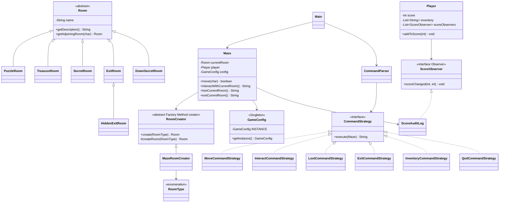

# Class Diagram

Implemented patterns:

- Strategy: `CommandStrategy` and its command-specific implementations.
- Singleton: `GameConfig`.
- Factory Method: `RoomCreator#createRoom`, implemented by `MazeRoomCreator`.
- Additional pattern: Observer through `ScoreObserver` and `ScoreAuditLog`.
